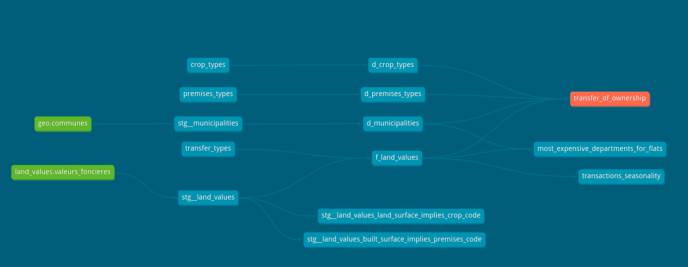

Welcome to the db-dremio demo project for subsurface !

### French open data used in this demo :

- [Demandes de valeurs foncières](https://www.data.gouv.fr/fr/datasets/demandes-de-valeurs-foncieres/) : Land values at transaction time (since late 2015).
- [Référentiel géographique français](https://data.enseignementsup-recherche.gouv.fr/explore/dataset/fr-esr-referentiel-geographique/export/) : Multi Hierarchical for the administrative dimension.

### Resources:
- [Subsurface conference](https://subsurfaceconf.com)
- Learn more about [dbt](https://docs.getdbt.com/docs/introduction)
- Learn more about [dremio](https://dremio.com)
- [dbt-dremio](https://github.com/fabrice-etanchaud/dbt-dremio)
